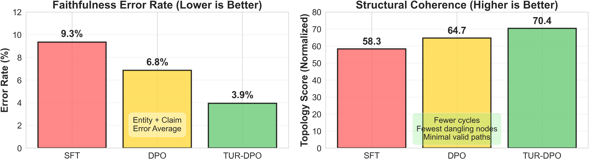
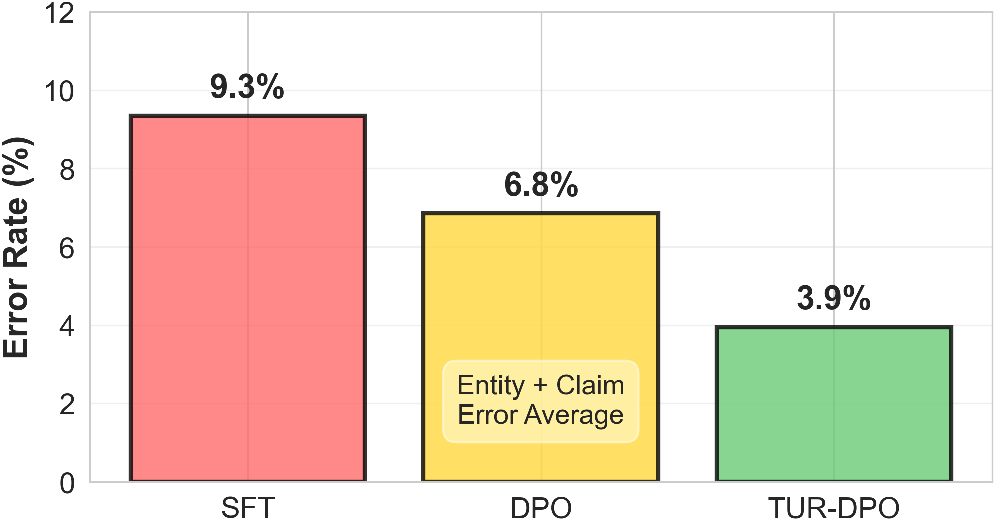
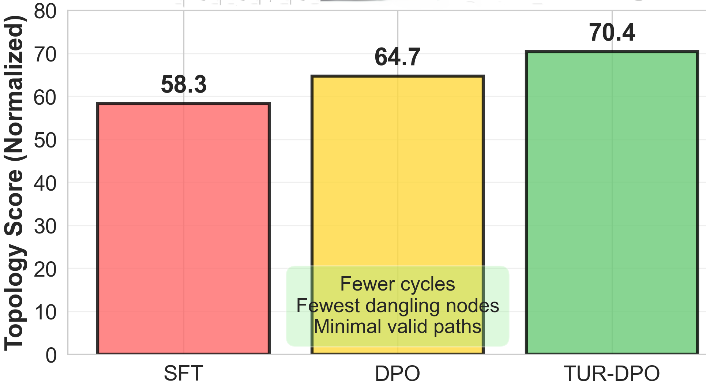
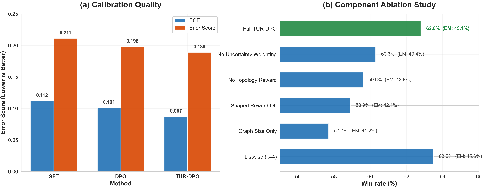
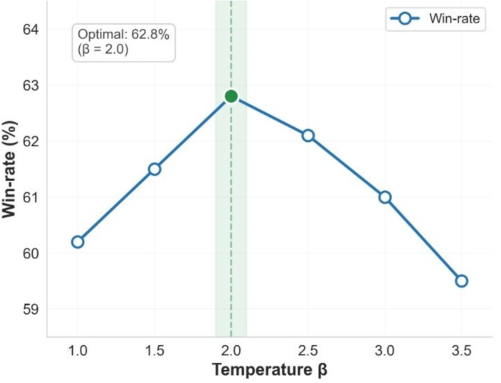
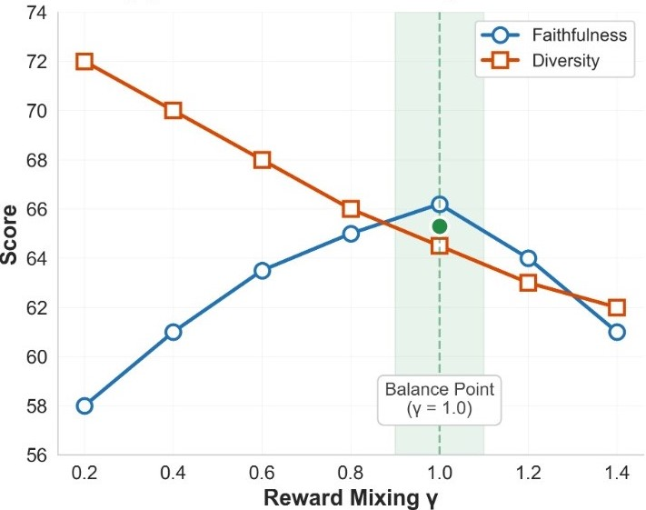
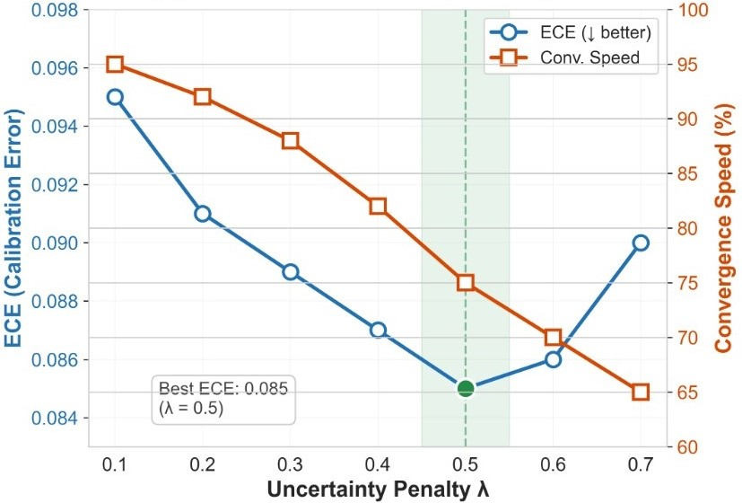
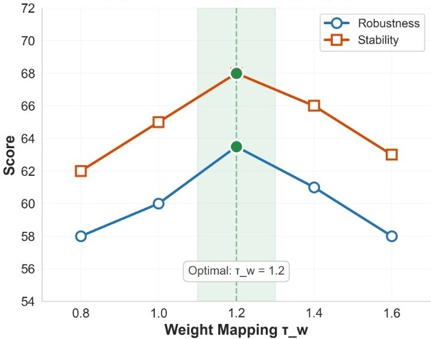

# TUR-DPO: Topology- and Uncertainty-Aware Direct Preference Optimization

[](https://arxiv.org/pdf/2605.00224)
[](LICENSE)

Official implementation of **TUR-DPO: Topology- and Uncertainty-Aware Direct Preference Optimization**.

**Authors:** Abdulhady Abas Abdullah, Fatemeh Daneshfar, Seyedali Mirjalili, Mourad Oussalah

**Paper:** [https://arxiv.org/pdf/2605.00224](https://arxiv.org/pdf/2605.00224)

---

## Overview

TUR-DPO is a topology- and uncertainty-aware extension of Direct Preference Optimization (DPO)
that rewards **how answers are derived**, not only what they say.
For each candidate response, TUR-DPO:

1. Elicits a lightweight **reasoning topology** (a graph of sub-claims and support relations)
2. Computes dual signals: **semantic faithfulness/utility** and **topology quality**
3. Derives a **calibrated uncertainty score** from graph- and node-level evidence
4. Uses these signals to shape the DPO loss with uncertainty-weighted pairs

> **Important:** The graph extractor is **fully offline** and uses a **frozen** auxiliary LLM,
> completely separate from the trainable policy model. There is no feedback loop
> (the policy outputs are never used for extraction during training).

---

## Method Overview

### Figure 1 -- RLHF vs. DPO vs. TUR-DPO

<p align="center">
  
</p>

> RLHF trains a reward model from preference data and optimizes the policy via PPO with KL
> regularization. DPO replaces this with a direct, RL-free preference objective. **TUR-DPO**
> augments DPO by incorporating lightweight reasoning topology, semantic, and uncertainty signals
> into a shaped reward and uncertainty-weighted DPO loss.

---

### Figure 2 -- Faithfulness and Structural Coherence

<p align="center">
  
  &nbsp;&nbsp;
  
</p>

> Left: Faithfulness metrics (lower is better).
> Right: Structural coherence metrics (higher is better).
> TUR-DPO reduces entity/claim error rates and improves topology scores over SFT and DPO.

---

### Figure 3 -- Calibration and Ablation Studies

<p align="center">
  
</p>

> Left: Calibration quality (ECE and Brier score) across SFT, DPO, and TUR-DPO -- lower is better.
> Right: Component ablation showing that both topology rewards and uncertainty weighting are
> necessary for full performance.

---

### Figure 4 -- Hyperparameter Sensitivity

<p align="center">
  
  &nbsp;&nbsp;
  
</p>
<p align="center">
  
  &nbsp;&nbsp;
  
</p>

> (a) Temperature beta -- broad optimum near beta=2.0.
> (b) Reward mixing gamma -- faithfulness/diversity trade-off, best near gamma=1.0.
> (c) Uncertainty penalty lambda -- improves calibration up to lambda=0.5.
> (d) Weight-mapping tau_w -- performance is robust and stable across wide ranges.

---

## Key Features

- **RL-free** -- No online rollouts, value heads, or reward model training
- **Structure-aware** -- Rewards coherent multi-step reasoning via topology scoring
- **Uncertainty-weighted** -- Down-weights noisy/brittle preference pairs
- **Efficient** -- Adds only ~15% overhead compared to vanilla DPO
- **Compatible** -- Works with any DPO-style codebase and dataset
- **Scalable** -- Tested on 7B, 8B, and 70B models

---

## Installation

```bash
git clone https://github.com/yourusername/turdpo.git
cd turdpo
pip install -e .
```

### Requirements

- Python >= 3.8
- PyTorch >= 2.0
- Transformers >= 4.30
- numpy, scipy, tqdm, scikit-learn

---

## Quick Start

### Basic Training

```python
from turdpo.trainer import TURDPOTrainer, TURDPOConfig
from turdpo.data import PreferenceDataset, create_dataloader
from transformers import AutoModelForCausalLM, AutoTokenizer

# Load models
model = AutoModelForCausalLM.from_pretrained("meta-llama/Llama-2-7b-hf")
reference_model = AutoModelForCausalLM.from_pretrained("meta-llama/Llama-2-7b-hf")
tokenizer = AutoTokenizer.from_pretrained("meta-llama/Llama-2-7b-hf")

# Configure TUR-DPO
config = TURDPOConfig(
    beta=2.0,                # DPO temperature
    gamma=1.0,               # Shaped reward weight
    a=0.6,                   # Semantic vs topology mixing
    lambda_uncertainty=0.5,  # Uncertainty penalty
    tau_w=1.2,               # Weight mapping temperature
    w_min=0.05,              # Minimum pair weight
    k_samples=3,             # Graph re-elicitation samples
    use_ema_reference=True,
    ema_decay=0.995
)

# Load data
dataset = PreferenceDataset.from_json("data/preferences.json", tokenizer)
dataloader = create_dataloader(dataset, batch_size=4)

# Train
trainer = TURDPOTrainer(
    model=model,
    reference_model=reference_model,
    tokenizer=tokenizer,
    config=config
)
results = trainer.train(dataloader, num_epochs=1)
```

### Command Line Training

```bash
python train.py \
    --model_name meta-llama/Llama-2-7b-hf \
    --train_data data/train.json \
    --beta 2.0 --gamma 1.0 --a 0.6 \
    --lambda_uncertainty 0.5 \
    --learning_rate 1e-6 \
    --batch_size 4 --num_epochs 1 \
    --output_dir outputs/
```

### Evaluation

```bash
# Print all benchmark results from paper/rebuttal
python evaluate.py --print_results

# Evaluate a trained model
python evaluate.py --model_path outputs/final_model --eval_data data/test.json

# Run failure analysis
python evaluate.py --model_path outputs/final_model --eval_data data/test.json --failure_analysis
```

---

## Results

### Main Results (LLaMA-2 7B, mean +/- std over 3 seeds)

| Task | DPO | TUR-DPO | Delta |
|------|-----|---------|-------|
| GSM8K (EM%) | 58.7 +/- 0.4 | **62.8 +/- 0.3** | +4.1 |
| MATH (EM%) | 33.4 +/- 0.5 | **36.0 +/- 0.4** | +2.6 |
| BBH (Acc%) | 43.9 +/- 0.3 | **46.7 +/- 0.3** | +2.8 |
| Open QA (EM) | 41.8 | **45.1** | +3.3 |
| TLDR (Win%) | 61.2 | **64.8** | +3.6 |
| HH (Win%) | 65.5 | **67.9** | +2.4 |

### Scalability to 70B (LLaMA-3 70B)

| Task | DPO | TUR-DPO | Delta |
|------|-----|---------|-------|
| GSM8K (EM%) | 72.1 | **75.6** | +3.5 |
| MATH (EM%) | 48.3 | **51.2** | +2.9 |

### Additional Model Families

**Mistral-7B-v0.3:**

| Task | DPO | IPO | TUR-DPO |
|------|-----|-----|---------|
| GSM8K (EM%) | 60.5 | 60.8 | **64.2** |
| MATH (EM%) | 35.1 | 35.4 | **37.6** |
| BBH (Acc%) | 45.6 | 45.9 | **48.3** |
| Open QA | 43.2 | 43.6 | **46.4** |
| TLDR (Win%) | 62.8 | 63.3 | **66.1** |
| HH (Win%) | 66.3 | 66.7 | **68.5** |

**Gemma-7B-v1.1:**

| Task | DPO | IPO | TUR-DPO |
|------|-----|-----|---------|
| GSM8K (EM%) | 59.8 | 60.1 | **63.5** |
| MATH (EM%) | 34.6 | 34.9 | **37.1** |
| BBH (Acc%) | 44.8 | 45.1 | **47.5** |
| Open QA | 42.5 | 42.9 | **45.8** |
| TLDR (Win%) | 62.1 | 62.6 | **65.5** |
| HH (Win%) | 65.9 | 66.3 | **68.0** |

### Domain Shift (Zero-Shot Transfer)

| Dataset | DPO | TUR-DPO | Delta |
|---------|-----|---------|-------|
| MedQA | 41.3 | **44.7** | +3.4 |
| LexGLUE | 52.8 | **55.2** | +2.4 |

---

## Topology Component Ablation

Individual topology components each contribute meaningfully:

| Variant | GSM8K | MATH | BBH |
|---------|-------|------|-----|
| Full TUR-DPO | **62.8** | **36.0** | **46.7** |
| - q_path (completeness) | 60.7 (-2.1) | 34.1 (-1.9) | 44.8 (-1.9) |
| - c_cycle (anti-circular) | 61.1 (-1.7) | 34.5 (-1.5) | 45.2 (-1.5) |
| - q_contradict (consistency) | 61.3 (-1.5) | 34.7 (-1.3) | 45.4 (-1.3) |
| - d_dangling (anti-leaps) | 61.9 (-0.9) | 35.3 (-0.7) | 46.0 (-0.7) |

---

## Resource Benchmarks

Measured on a single A100 (80 GB), 614k preference pairs, batch_size=4:

| Method | Peak VRAM (GB) | Throughput (tok/s) | Wall Time (hrs) |
|--------|---------------|-------------------|-----------------|
| DPO | 38.2 | 1420 | 45 |
| PPO-RLHF | 62.7 | 580 | 112 |
| **TUR-DPO** | 41.6 | 1210 | **52** |

TUR-DPO adds only ~15% overhead vs DPO and requires ~42 GPU-hours (on 8xA100) to
match a 65% HH win-rate, compared to 48 GPU-hours for DPO -- sample efficiency compensates.

---

## Graph Extraction Quality

Blind manual audit of 200 graphs by two NLP analysts (Cohen's kappa = 0.82):

| Metric | Score |
|--------|-------|
| Claim Precision (nodes reflect text) | 0.94 |
| Edge Validity (relations are sound) | 0.91 |
| Logical Completeness (no dropped layers) | 0.88 |

The epistemic uncertainty system down-weights ~14% of structurally indeterminate edges,
making the pipeline error-tolerant.

---

## Failure Taxonomy

Breakdown of error types on GSM8K / MATH:

| Error Type | Freq | Description | Mitigation |
|------------|------|-------------|------------|
| Formatting | 38% | Missing \\boxed{} syntax | Regex post-processing |
| Arithmetic | 24% | Calculation errors | Calculator integration |
| Logical Leap | 18% | Unstated premises | Increased K sampling |
| Hallucinated Entity | 12% | False entities | Stricter NLI verification |
| Contradiction | 8% | Internal discrepancy | Penalised by alpha_contradict |

With inference-time regex guardrails, TUR-DPO reaches 63.5% EM on GSM8K.

---

## Hyperparameter Selection Framework

Parameters follow a **three-tier framework** for reproducibility:

| Tier | Parameters | Selection |
|------|-----------|-----------|
| 1 -- Offline calibration | alpha_path, alpha_cycle, alpha_dangling, alpha_contradict | Calibrated once on 2% held-out split |
| 2 -- Validation tuning | beta, gamma, a, lambda_uncertainty | Minimal grid search |
| 3 -- Fixed globally | lambda_epi, lambda_ale, tau_w, w_min, tau_smoothing | Same across all tasks/datasets |

Sensitivity sweeps show large, stable plateaus: varying alpha and lambda produces
max win-rate changes within +/-1.2% across all benchmarks.

### Default Hyperparameters

| Parameter | Default | Description |
|-----------|---------|-------------|
| `beta` | 2.0 | DPO temperature (sharpness) |
| `gamma` | 1.0 | Shaped reward weight in loss |
| `a` | 0.6 | Semantic vs topology mixing |
| `lambda_uncertainty` | 0.5 | Uncertainty penalty in reward |
| `lambda_epi` | 0.5 | Epistemic uncertainty weight |
| `lambda_ale` | 0.5 | Aleatoric uncertainty weight |
| `tau_w` | 1.2 | Weight mapping temperature |
| `w_min` | 0.05 | Minimum pair weight floor |
| `k_samples` | 3 | Re-elicited graphs per response |
| `ema_decay` | 0.995 | EMA decay for reference policy |

---

## Mathematical Formulation

### DPO Preliminary

Standard DPO optimizes an implicit reward in closed form:

```
L_DPO = -log sigma(beta * [log pi_theta(y+|x)/pi_ref(y+|x)
                          - log pi_theta(y-|x)/pi_ref(y-|x)])
```

### TUR-DPO -- Formal Generalization

TUR-DPO adds a static, offline-computed shaped reward margin.
The partition function Z(x) cancels exactly in pairwise differences,
preserving DPO's closed-form gradient. When gamma=0, TUR-DPO reduces to DPO.

**Topology Score (Eq. 1):**
```
s_topo(G) = a1*q_path - a2*c_cycle - a3*d_dangling - a4*q_contradict
```

**Semantic Score (Eq. 2):**
```
s_sem(x,y) = b1*q_fact + b2*q_task - b3*q_hall
```
where q_fact = average of binary correctness labels from a calibrated NLI verifier
across all atomic assertions in the response graph.

**Total Uncertainty (Eq. 3):**
```
u(G) = l_epi * u_epi(G) + l_ale * u_ale(G)
```

**Shaped Reward (Eq. 7):**
```
r(x,y,G) = a * f_sem(s_sem) + (1-a) * f_topo(s_topo) - lambda * u(G)
```

**TUR-DPO Loss (Eq. 9):**
```
L = -w * log sigma(beta * [D_log_pi_theta - D_log_pi_ref] + gamma * D_r)
```

---

## Graph Extraction Pipeline

The extraction is **fully offline** -- graphs are computed once before training:

1. **Decomposition:** A frozen auxiliary LLM decomposes response y into atomic
   reasoning statements (nodes V). This uses a deterministic prompt, not the
   trainable policy.

2. **NLI classification:** An offline NLI classifier labels directed logical
   relations (entailment, support, contradiction) to form the edge set E.

3. **Validation:** Structural metrics (path coverage, cycle detection,
   dangling nodes, contradiction rate) and epistemic uncertainty from K
   independently sampled graphs.

4. **Reward computation:** Static offline reward r_phi is computed from
   topology + uncertainty. This acts as a fixed margin in the DPO objective.

**No feedback loop:** The policy pi_theta is never used for extraction.

---

## Project Structure

```
turdpo/
|-- images/                          # Paper figures
|-- turdpo/
|   |-- __init__.py                  # Package exports
|   |-- topology.py                  # Graph extraction and scoring
|   |-- uncertainty.py               # Uncertainty estimation
|   |-- rewards.py                   # Shaped reward computation
|   |-- loss.py                      # TUR-DPO loss (with DPO proof sketch)
|   |-- trainer.py                   # Main training loop
|   |-- verifier.py                  # Node verification
|   |-- calibration.py               # ECE, Brier, temperature scaling
|   |-- data.py                      # Data loading utilities
|   `-- utils.py                     # Metrics, profiler, failure taxonomy
|-- tests/                           # Unit tests
|-- examples/
|   `-- demo.py
|-- configs/
|   `-- default.json                 # Three-tier hyperparameter config
|-- train.py                         # Training entry point
|-- evaluate.py                      # Evaluation and benchmarking
`-- README.md
```

---

## Data Format

Preference pairs in JSON/JSONL format:

```json
{
  "prompt": "What is 15 + 27?",
  "chosen": "To solve 15+27: ones 5+7=12, tens 10+20=30, total 42.",
  "rejected": "15 + 27 = 43",
  "task_score_chosen": 1.0,
  "task_score_rejected": 0.0
}
```

---

## Supported Models

| Model | Parameters | Tested |
|-------|-----------|--------|
| LLaMA-2-7B | 7B | Yes |
| LLaMA-3-8B | 8B | Yes |
| Mistral-7B-v0.3 | 7B | Yes |
| Gemma-7B-v1.1 | 7B | Yes |
| LLaMA-3-70B | 70B | Yes |

---

## Citation

```bibtex
@inproceedings{abdullah2026turdpo,
  title     = {TUR-DPO: Topology- and Uncertainty-Aware Direct Preference Optimization},
  author    = {Abdullah, Abdulhady Abas and Daneshfar, Fatemeh and Mirjalili, Seyedali and Oussalah, Mourad},
  booktitle = {Proceedings of the 43rd International Conference on Machine Learning (ICML)},
  year      = {2026},
  url       = {https://arxiv.org/pdf/2605.00224}
}
```

---

## License

MIT License -- see [LICENSE](LICENSE) for details.

---

## Acknowledgments

- TUR-DPO builds on [Direct Preference Optimization (DPO)](https://arxiv.org/abs/2305.18290)
- Graph extraction inspired by reasoning topology research
- Uncertainty estimation draws from semantic entropy work
- Topology components motivated by Neuro-symbolic AI and Formal Verification
